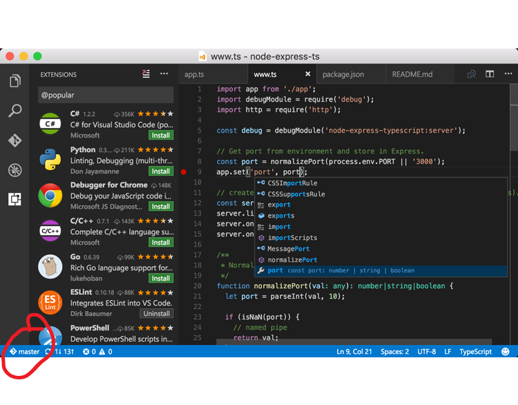

# SE-Assignment-5
Installation and Navigation of Visual Studio Code (VS Code)
 Instructions:
Answer the following questions based on your understanding of the installation and navigation of Visual Studio Code (VS Code). Provide detailed explanations and examples where appropriate.

 Questions:

1. Installation of VS Code:
- Describe the steps to download and install Visual Studio Code on Windows 11 operating system. Include any prerequisites that might be needed.

Answer:
Prerequisites:
Administrator Access: Ensure you have administrative privileges to install software on your Windows 11 system.
Internet Connection: An active internet connection is required to download the installation files.
Steps to Download and Install Visual Studio Code:
Visit the Official VS Code Website:

Open your web browser and navigate to the official Visual Studio Code download page: [https://code.visualstudio.com/](https://code.visualstudio.com/).

On the VS Code homepage, you will see a "Download for Windows" button. Click this button to download the installer.
Run the Installer:

Once the installer (VSCodeSetup-x64-<version>.exe) is downloaded, locate it in your Downloads folder and double-click it to run the setup wizard.
Begin Installation:

A setup wizard will open. Click on the "Next" button to proceed with the installation.
Accept the License Agreement:

Read the license agreement and check the "I accept the agreement" box. Then click "Next" to continue.
Select Installation Location:

Choose the destination folder where you want VS Code to be installed. The default location is usually fine. Click "Next".
Select Additional Tasks:

Here, you can choose additional options such as:
Creating a desktop icon.
Adding "Open with Code" action to the context menu.
Registering VS Code as the default editor for supported file types.
It's recommended to check the options that you find useful. Click "Next" to proceed.
Install:

Review your installation settings and click the "Install" button to begin the installation.
Complete the Installation:

Once the installation is complete, you can choose to launch Visual Studio Code immediately by checking the "Launch Visual Studio Code" box. Click "Finish" to exit the setup wizard.
Launch VS Code:

If you didn't launch VS Code from the setup wizard, you can open it from the Start menu or the desktop shortcut if you created one.
First Launch and Setup:
Welcome Screen:
Upon launching VS Code for the first time, you will see a Welcome screen that provides options to start a new file, open a folder, or customize your settings.
Install Extensions (Optional):
VS Code is highly customizable with extensions. You can install extensions for various programming languages, themes, debuggers, and more from the Extensions view (Ctrl+Shift+X).

2. First-time Setup:
- After installing VS Code, what initial configurations and settings should be adjusted for an optimal coding environment? Mention any important settings or extensions.

Answer:
1. User Settings Configuration
Open the Command Palette with Ctrl+Shift+P and type Preferences: Open Settings (UI).
Theme: Set your preferred color theme.
Navigate to File > Preferences > Color Theme or use Ctrl+K Ctrl+T.
Choose between Dark, Light, or other themes available.

Font Size and Family:
Search for Editor: Font Size to set a comfortable font size.
Search for Editor: Font Family to set your preferred font (e.g., Fira Code).
Tab and Indentation Settings:
Editor: Tab Size - Set to your preferred tab size (commonly 2 or 4 spaces).
Editor: Insert Spaces - Enable this to use spaces instead of tabs.
Auto Save:
Search for Files: Auto Save and set it to afterDelay for automatic saving.
Minimap:
Toggle the minimap by searching for Editor: Minimap Enabled.
2. Essential Extensions
Open the Extensions view with Ctrl+Shift+X.
Popular Extensions:
Python: Microsoft’s official Python extension for linting, debugging, and more.
ESLint: Integrates ESLint JavaScript into VS Code.
Prettier - Code formatter: Automatic code formatting.
Live Server: Launch a local development server with live reload feature for static and dynamic pages.
GitLens: Supercharges the Git capabilities built into VS Code.
Docker: Adds syntax highlighting, commands, hover tips, and linting for Dockerfile and docker-compose files.
IntelliCode: AI-assisted code recommendations.
3. Customization of Workspace
Set Up Workspaces:
Create and open a new workspace via File > Add Folder to Workspace.
Save your workspace configuration with File > Save Workspace As.
Configure Language Specific Settings:
Open the settings JSON with Ctrl+,.
Add configurations specific to programming languages you use, for example:
"[python]": {
"editor.tabSize": 4,
"editor.insertSpaces": true
},
"[javascript]": {
"editor.tabSize": 2,
"editor.insertSpaces": true
}
4. Keybindings
Customize keybindings via File > Preferences > Keyboard Shortcuts or Ctrl+K Ctrl+S.
You can search for commands and change their shortcuts by double-clicking on them.
5. Integrated Terminal Configuration
Open the terminal with Ctrl+`.
Set your preferred shell by searching for Terminal: Integrated Shell in the settings.
6. Sync Settings Across Devices
Sign in with your GitHub or Microsoft account.
Enable Settings Sync via File > Preferences > Settings Sync.
7. Code Snippets
Customize or add new code snippets by navigating to File > Preferences > User Snippets.
Choose a language for the snippet or create a global snippet.
Example snippet for JavaScript:
"Print to console": {
"prefix": "log",
"body": [
"console.log('$1');",
"$2"
],
"description": "Log output to console"
}
8. Version Control Integration
Ensure Git is installed on your system.
Open the Source Control view with Ctrl+Shift+G.
Initialize a repository or clone an existing one.

3. User Interface Overview:
- Explain the main components of the VS Code user interface. Identify and describe the purpose of the Activity Bar, Side Bar, Editor Group, and Status Bar.

Answer:

Activity Bar
The Activity Bar is located on the far left side of the window. It allows you to switch between different views and provides access to various functions.

Icons and Functions:
Explorer: View and manage your project files and folders.
Search: Perform text searches within your project files.
Source Control: Access Git features to manage version control.
Run and Debug: Debug your code and manage debug configurations.
Extensions: Browse and install extensions to enhance VS Code functionality.

Side Bar
The Side Bar is located next to the Activity Bar and displays different panels depending on the icon selected in the Activity Bar.

Components:
Explorer Panel: Displays your project's file and folder structure.
Search Panel: Provides search results within your project.
Source Control Panel: Shows version control status and actions.
Run and Debug Panel: Contains debugging options and information.
Extensions Panel: Lists installed extensions and recommendations.

Editor Group
The Editor Group is the central area of the VS Code interface where you write and edit your code. You can have multiple editor tabs open, organized into groups.

Features:
Tabs: Each open file is represented by a tab at the top of the editor group.
Split View: You can split the editor into multiple groups to view and edit multiple files side by side.
Code Navigation: Use features like Go to Definition, Find References, and more for efficient coding.

Status Bar
The Status Bar is located at the bottom of the VS Code window. It provides information and shortcuts related to the current context.

Information and Shortcuts:
Current Branch: Shows the current Git branch if you have a repository open.
Encoding and Line Endings: Displays the file's encoding and line ending type.
Language Mode: Indicates the programming language of the file being edited.
Errors and Warnings: Shows the count of errors and warnings in the code.
Live Share: If installed, shows the status of Live Share sessions.

4. Command Palette:
- What is the Command Palette in VS Code, and how can it be accessed? Provide examples of common tasks that can be performed using the Command Palette.

Answer:
The Command Palette in Visual Studio Code (VS Code) is a powerful tool that allows users to access various commands and features through a text-based interface. It provides a quick way to execute commands without needing to navigate through menus or memorize keyboard shortcuts.

Accessing the Command Palette
You can access the Command Palette by using the keyboard shortcut Ctrl+Shift+P (Windows/Linux). Alternatively, you can click on the "View" menu in the top navigation bar and select "Command Palette."

Examples of Common Tasks
Changing the Color Theme:

Open the Command Palette (Ctrl+Shift+P), type Preferences: Color Theme, and select from the list of available themes.
Opening a File or Folder:

Use the Command Palette (Ctrl+Shift+P), type File: Open File or File: Open Folder, and then navigate to the desired location.
Running Tasks:

For example, to run tasks defined in your tasks.json file, type Run Task in the Command Palette and select the task you want to execute.
Searching for Files:

Use the Command Palette (Ctrl+Shift+P), type File: Quick Open, and start typing the name of the file you want to open.
Version Control Actions:

Type Git: Pull or Git: Push in the Command Palette to perform Git operations like pulling changes from or pushing changes to a remote repository.
Debugging:

Start debugging by typing Debug: Start Debugging in the Command Palette, or configure and manage debug configurations using commands like Debug: Add Configuration.
Installing Extensions:

To install extensions, type Extensions: Install Extensions in the Command Palette, search for the desired extension, and click Install.
Changing Language Mode:

Use the Command Palette (Ctrl+Shift+P), type Change Language Mode, and select the programming language mode you want to set for the current file.

5. Extensions in VS Code:
 - Discuss the role of extensions in VS Code. How can users find, install, and manage extensions? Provide examples of essential extensions for web development.

Answer:
Role of Extensions
Extensions in VS Code extend its core capabilities, making it adaptable to different programming languages, development workflows, and personal preferences. They enable users to:

Add Language Support: Extensions provide syntax highlighting, IntelliSense (code completion and suggestion), and debugging support for various programming languages.
Integrate Tools: Extensions integrate with external tools and services, such as Git version control, Docker containers, and cloud platforms.
Enhance Productivity: They automate tasks, provide code snippets, and offer powerful debugging and testing features.
Customize Themes and UI: Extensions offer themes for customizing the editor's appearance and UI elements.
Finding, Installing, and Managing Extensions
Finding Extensions:

Open the Extensions view in VS Code (Ctrl+Shift+X) or click on the Extensions icon in the Activity Bar.

Browse through the Marketplace to discover extensions. You can search by name, category, or tag.
Installing Extensions:

Click on the extension you want to install and then click the "Install" button.
Some extensions may require additional dependencies or permissions.
Managing Extensions:

Disable or uninstall extensions you no longer need by clicking on the gear icon next to the extension in the Extensions view.
Update extensions manually or enable automatic updates.
Examples of Essential Extensions for Web Development
Here are some essential extensions for web development in VS Code:

HTML CSS Support:
Provides autocompletion, formatting, and validation for HTML and CSS.
Live Server:
Launches a local development server with live reload capability for static and dynamic pages.
ESLint:
Integrates ESLint for JavaScript/TypeScript linting and formatting.
Prettier - Code formatter:
Automatically formats code based on Prettier rules for consistent styling across your project.
Debugger for Chrome:
Allows debugging JavaScript code directly from VS Code in the Google Chrome browser.
GitLens:
Supercharges the Git capabilities built into VS Code with additional features like blame annotations, commit history, and comparisons.

6. Integrated Terminal:
- Describe how to open and use the integrated terminal in VS Code. What are the advantages of using the integrated terminal compared to an external terminal?

Answer: 
Opening the Integrated Terminal
To open the integrated terminal in VS Code:

Using Keyboard Shortcut:

Press Ctrl+` (Backtick key) to open the integrated terminal.
Using Menu:

Click on Terminal in the top menu bar and select New Terminal.

Using the Integrated Terminal
Once the integrated terminal is open:

You can navigate through directories using familiar command-line commands (cd, ls on macOS/Linux or dir on Windows).
Run scripts or commands directly in the terminal.
Install dependencies (npm install, pip install, etc.) directly from the terminal.
Start local servers (node server.js, python -m http.server, etc.) for development purposes.
Advantages of Using the Integrated Terminal
Seamless Integration:

Work within the same environment as your code without switching between applications.
Contextual Awareness:

The terminal automatically opens at the root of your project, maintaining context.
Efficiency:

Quickly execute commands without leaving your editor, enhancing productivity.
Customization:

Customize the terminal's shell type (Bash, PowerShell, etc.) and appearance to suit your preferences.
Debugging:

Debug directly from the integrated terminal with debugging commands or tools available in VS Code.
Multi-Platform Consistency:

Works consistently across different operating systems without additional setup.

7. File and Folder Management:
- Explain how to create, open, and manage files and folders in VS Code. How can users navigate between different files and directories efficiently?

Answer:
Creating Files and Folders
Creating a New File:

Click on File in the top menu bar.
Select New File to create a new file in the root directory of your workspace.

Alternatively, use the keyboard shortcut Ctrl+N (Windows/Linux) to create a new file.
Creating a New Folder:

Click on File in the top menu bar.
Select New Folder to create a new folder in the root directory of your workspace.
Alternatively, use the keyboard shortcut Ctrl+Shift+N (Windows/Linux) to create a new folder.
Opening Files and Folders
Opening a File:

Click on File in the top menu bar.
Select Open File... to navigate to and open a specific file.
Use the keyboard shortcut Ctrl+O (Windows/Linux)  to open a file.
Opening a Folder:

Click on File in the top menu bar.
Select Open Folder... to open an entire folder as a workspace in VS Code.
Use the keyboard shortcut Ctrl+K Ctrl+O (Windows/Linux)  to open a folder.
Managing Files and Folders
Renaming Files and Folders:

Right-click on a file or folder in the Explorer view or the file tabs and select Rename, or press F2.
Deleting Files and Folders:

Right-click on a file or folder in the Explorer view and select Delete, or press Delete on your keyboard.
Moving/Copying Files and Folders:

Drag and drop files or folders within the Explorer view to move them.
Use the context menu options (Cut, Copy, Paste) or keyboard shortcuts (Ctrl+C to copy, Ctrl+X to cut, Ctrl+V to paste) to move or copy files/folders within or between directories.
Navigating Between Files and Directories
Using File Explorer:

Utilize the Explorer view (Ctrl+Shift+E) to navigate through files and folders within your project.
Double-click on a file to open it in the editor.
Switching Between Open Files:

Use Ctrl+Tab (Windows/Linux) to switch between open files in the editor.
Use Ctrl+P (Windows/Linux) to quickly navigate to any file in your project by typing its name.
Navigating with Breadcrumbs:

Enable breadcrumbs (View > Toggle Breadcrumbs) to navigate within files and folders directly from the editor's top bar.

8. Settings and Preferences:
- Where can users find and customize settings in VS Code? Provide examples of how to change the theme, font size, and keybindings.

Answer:
Finding and Customizing Settings
Accessing Settings:

Open the Command Palette (Ctrl+Shift+P).
Type and select Preferences: Open Settings (UI) to open the settings interface.
Customizing Settings:

In the Settings UI, you can adjust various aspects of VS Code to suit your preferences and workflow.
Examples of Customizations
Changing the Theme:

Navigate to File > Preferences > Color Theme or use the Command Palette (Ctrl+K Ctrl+T) to change the color theme.
Select a theme from the list of installed themes or install new ones from the Marketplace.
Adjusting Font Size and Family:

Search for Editor: Font Size to change the size of the editor font.
Search for Editor: Font Family to set a custom font family (e.g., Fira Code).
Customizing Keybindings:

Navigate to File > Preferences > Keyboard Shortcuts or use the Command Palette (Ctrl+K Ctrl+S) to customize keybindings.
Search for commands and change their shortcuts by clicking on the pencil icon next to each command.

9. Debugging in VS Code:
- Outline the steps to set up and start debugging a simple program in VS Code. What are some key debugging features available in VS Code?

Answer:
Setting Up and Starting Debugging
Install Required Extensions:

Ensure you have the necessary language-specific debugger extensions installed (e.g., Node.js Debugger for JavaScript/TypeScript, Python extension for Python, etc.).
Create or Open a Project:

Open VS Code and either create a new project or open an existing one where you want to debug your code.
Configure Debugging Launch Configuration:

Open the Command Palette (Ctrl+Shift+P).
Type and select Debug: Open launch.json to create a new launch configuration file or modify an existing one.

Select a Debugger:

Choose the appropriate debugger for your programming language (e.g., Node.js, Python, Java, etc.) from the list of available debuggers.

Set Breakpoints:

Navigate to the file where you want to set breakpoints (lines where execution should pause for inspection).
Click in the gutter area next to the line number to set a breakpoint. Alternatively, use the keyboard shortcut F9.
Start Debugging:

Press F5 or click on the Run and Debug icon in the Activity Bar and then click Start Debugging.
Debugging Controls:

Use controls such as Step Over (F10), Step Into (F11), Step Out (Shift+F11), Continue (F5), and Stop to navigate through your code and inspect variables.
Key Debugging Features in VS Code
Variable Watch:

Monitor and inspect the values of variables in real-time while debugging.
Call Stack:

View the current execution stack, showing the path of function calls that led to the current point in the code.
Breakpoints:

Set breakpoints to pause execution at specific lines of code for detailed inspection.
Debug Console:

Evaluate expressions and execute code snippets in the context of the current debugging session.
Conditional Breakpoints:

Set breakpoints with conditions, allowing them to break only when certain conditions are met.
Debugging Task Automation:

Configure tasks to run automatically when debugging starts, such as compiling code or launching a server.

10. Using Source Control:
- How can users integrate Git with VS Code for version control? Describe the process of initializing a repository, making commits, and pushing changes to GitHub.

Answer:
Initializing a Repository
Open or Create a Project:

Open your project folder in VS Code or create a new project.

Open the Source Control View:

Open the Source Control view by clicking on the Source Control icon in the Activity Bar (Ctrl+Shift+G).
Initialize Git Repository:

Click on Initialize Repository in the Source Control view.
Alternatively, open the Command Palette (Ctrl+Shift+P), type and select Git: Initialize Repository.

Add Files to Git:

Stage files for the initial commit by clicking the + icon next to each file in the Source Control view or use the git add . command in the integrated terminal.
Making Commits
Commit Changes:

Enter a commit message describing your changes in the text box at the top of the Source Control view.
Click the checkmark icon (Commit) or use Ctrl+Enter to commit the staged changes.

View Commit History:

Click on the ... menu in the Source Control view to view commit history or use git log in the integrated terminal.
Pushing Changes to GitHub
Linking GitHub Repository:

If not already linked, add your GitHub repository as a remote. Use git remote add origin <repository_url> in the integrated terminal.
Push Changes:

Push commits to GitHub by clicking on the ... menu in the Source Control view and selecting Push.

Alternatively, use the git push command in the integrated terminal.

REFERENCES:
Get Started with Visual Studio Code. Retrieved from https://code.visualstudio.com/docs
Debugging in Visual Studio Code. Retrieved from https://code.visualstudio.com/docs/editor/debugging
Chacon, S., & Straub, B. (2014). Pro Git (2nd ed.). Apress. Retrieved from https://git-scm.com/book/en/v2
GitHub. (n.d.). Connecting to GitHub with SSH. Retrieved from https://docs.github.com/en/authentication/connecting-to-github-with-ssh

Submission Guidelines:
- Your answers should be well-structured, concise, and to the point.
- Provide screenshots or step-by-step instructions where applicable.
- Cite any references or sources you use in your answers.
- Submit your completed assignment by 1st July 